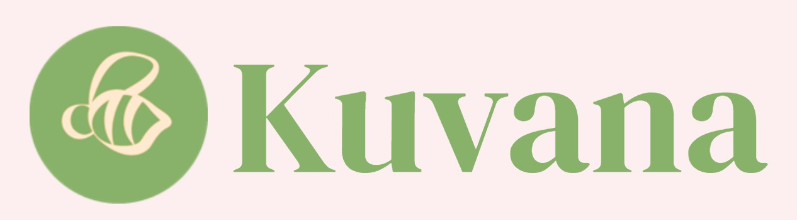

## Technical Description
Kuvana is a decentralized microfinancing protocol built natively on the Polkadot ecosystem. It will enable trust-minimized, cross-chain lending and borrowing of microloans, leveraging Polkadot’s scalable multichain architecture. Kuvana uses Polkadot’s Relay Chain security, XCM for cross-consensus communication and XCMP for efficient cross-chain message passing. PolkaVM provides much faster speeds and efficent computation than the well known EVM for performant smart contract execution and lower gas fees. Interopability with parachains and dApps across the ecosystem provide ample room for expansion and scaling. Integration with the Polkadot Asset Hub means loan seekers can use many different tokens and assets from different chains as collateral for the loan, opening up a wider door of opportunity.

## Gallery

